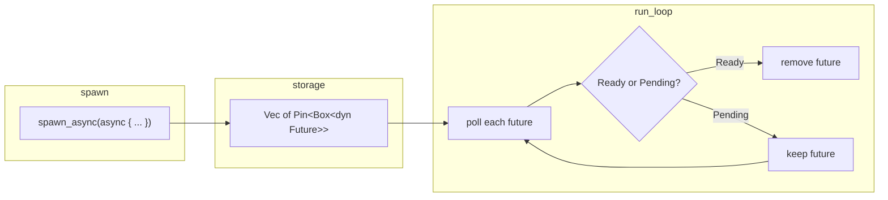
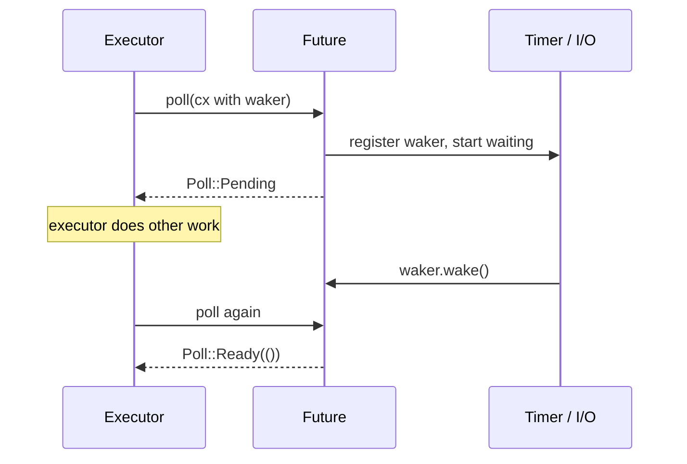

# Futures in Rust — A Guide for Step 4

**Companion to:** [challenge/04-tiny-executor.md](../challenge/04-tiny-executor.md)

You already built an event loop that runs callbacks and timers. Step 4 adds a new kind of work: **async blocks** — real Rust `Future`s, polled by your loop until they finish. No Tokio. Just the standard library.

This article explains what futures are, how they differ from the callback tasks you wrote in steps 1–2, and exactly what your executor needs to do.

---

## The one-sentence version

A **future** is lazy work that only moves forward when something **polls** it. Your **executor** (the event loop) is that something.

---

## Why futures exist

In steps 1–2, you scheduled work like this:

```rust
event_loop.spawn(|| {
    println!("hello");
});

event_loop.set_timeout(Duration::from_millis(10), || {
    println!("later");
});
```

Each unit of work is a **closure that runs once, right now** (or when a timer fires). Simple and direct.

Async code looks different:

```rust
event_loop.spawn_async(async {
    println!("hello from async");
});

event_loop.run();
```

That `async { ... }` block does **not** run when you call `spawn_async`. It becomes a **future** — a state machine that may pause, resume, and eventually finish. Something must **drive** it. In step 4, that driver is your event loop.

| Steps 1–2 | Step 4+ |
|---|---|
| `spawn(fn)` — run this function now | `spawn_async(async { ... })` — store this future |
| Work is eager | Work is lazy |
| You call the closure | You poll the future |
| Done when the function returns | Done when `poll` returns `Poll::Ready` |

---

## What is a `Future`?

The [`Future`](https://doc.rust-lang.org/std/future/trait.Future.html) trait is Rust's core abstraction for "a value that isn't ready yet":

```rust
pub trait Future {
    type Output;

    fn poll(self: Pin<&mut Self>, cx: &mut Context<'_>) -> Poll<Self::Output>;
}
```

Three pieces matter:

| Piece | Meaning |
|---|---|
| `Output` | What you get when the future completes (`()` for `async` blocks that return nothing) |
| `poll` | "Try to make progress. Tell me if you're done or need to wait." |
| `Poll<T>` | Either `Ready(value)` or `Pending` |

### Futures are lazy

This is the most important rule. Creating a future does nothing:

```rust
let f = async { println!("hi"); };  // nothing printed yet
```

The `println!` only runs when something calls `poll` and the future reaches that point in its state machine.

Compare with your callback queue:

```rust
self.queue.push_back(Box::new(f));  // stored, not run
// ...
task();  // NOW it runs
```

Futures follow the same "store first, run later" idea — but "run" means **poll**, not "call once and forget."

### What `poll` returns

Every time you poll a future, you get one of two answers:

```rust
Poll::Ready(output)   // finished — you can remove this future
Poll::Pending         // not done — keep it, poll again later
```

Think of `poll` as asking: *"Can you do any work right now without blocking?"*

- If yes → the future runs a bit (or finishes) and may return `Ready`.
- If no → it returns `Pending` and says: *"Wake me when something changes."*

**Never block inside `poll`.** Don't call `thread::sleep`, don't wait on a mutex, don't read from a socket in a blocking way. If the future can't proceed, return `Pending`. (Step 5's `sleep().await` follows this rule — the timer fires later and wakes the task.)

---

## What `async` / `.await` actually are

You write:

```rust
async {
    println!("before");
    sleep(Duration::from_millis(10)).await;
    println!("after");
}
```

The compiler transforms this into a struct implementing `Future`. Rough mental model:

```text
async block state machine:

  start → println "before" → await sleep → (paused) → println "after" → Ready(())
```

Each `.await` is a **pause point**. When the future is polled:

1. It runs until the next `.await` or the end.
2. If it hits an `.await` on something not ready → returns `Pending`.
3. When that inner future becomes ready → your future gets polled again and continues past the `.await`.

For step 4, simple blocks with **no** `.await`:

```rust
async {
    println!("hello from async");
}
```

…usually complete on the **first poll**. There's nothing to wait for.

Step 5 adds `.await` on `sleep()`, so you'll see `Pending` in practice.

---

## What is an executor?

An **executor** owns a collection of futures and **polls** them in a loop until they complete.

Tokio is an executor. Your `EventLoop` is becoming one.



A minimal executor loop looks like this in pseudocode:

```text
loop:
    for each future in futures:
        match future.poll(context):
            Poll::Ready(())  → mark for removal
            Poll::Pending    → keep it

    remove all Ready futures

    if no work left (queue, timers, futures all empty):
        break
```

That matches what you described: **keep iterating, poll every in-flight future each turn, remove the ones that return `Ready`.**

---

## Mapping this onto your `EventLoop`

You already have the storage side:

```rust
futures: Vec<Pin<Box<dyn Future<Output = ()> + 'static>>>,

pub fn spawn_async<F>(&mut self, f: F)
where
    F: Future<Output = ()> + 'static,
{
    self.futures.push(Box::pin(f));
}
```

What's left for step 4 is the **polling pass** inside `run()`, plus making sure the loop knows futures exist.

### Where polling fits in `run()`

Your loop today:

```text
loop:
    ensure_work()    // wait for timers / I/O if idle
    run_timers()     // fire expired timer callbacks
    run_tasks()      // drain the callback queue
    if all_done(): break
```

After step 4:

```text
loop:
    ensure_work()
    run_timers()
    run_tasks()
    poll_futures()   // NEW — poll each future once
    if all_done(): break
```

### `all_done()` must include futures

If `futures` is non-empty, the loop is not done — even when every future is `Pending`. Those tasks are paused, not finished.

```rust
fn all_done(&self) -> bool {
    self.queue.is_empty()
        && self.timers.is_empty()
        && self.futures.is_empty()   // don't forget this
}
```

### Don't drop unfinished futures

The challenge hint is load-bearing. A future that returned `Pending` is mid-computation. Drop it and that task never completes.

- `Poll::Ready` → safe to remove (the future is consumed by a successful poll)
- `Poll::Pending` → must stay in the vec

---

## Why `Pin<Box<dyn Future<...>>>`?

You'll see this type a lot. Each part has a job:

| Part | Why |
|---|---|
| `dyn Future<Output = ()> + 'static` | Store different async blocks in one vec (trait object) |
| `Box<...>` | Heap-allocate (futures can be large state machines) |
| `Pin<...>` | The future must not move in memory while being polled |

### The Pin problem in one paragraph

`async` blocks compile into state machines that sometimes hold **self-referential** pointers — internal fields that point to other fields in the same struct. If the struct is moved in memory, those pointers break.

`Pin` is a promise: *"I won't move this value again."* `Future::poll` takes `Pin<&mut Self>` so the state machine can safely hold those internal pointers.

**Good news for step 4:** you rarely pin by hand. `Box::pin(f)` when spawning is the right pattern. You don't need to become a pinning expert yet.

---

## What is a `Waker`?

When a future returns `Poll::Pending`, it means: *"I can't progress until something happens."* The future (or something it `.await`s) must later tell the executor: **poll me again.**

That message goes through a [`Waker`](https://doc.rust-lang.org/std/task/struct.Waker.html).



Flow:

1. Executor polls future, passing a `Context` that contains a `Waker`.
2. Future can't proceed → stores/clones the waker, returns `Pending`.
3. Later, the timer expires (or I/O is ready) → something calls `waker.wake()`.
4. Executor polls that future again.

### Step 4: waker stub is fine

For simple `async { println!(...); }` blocks with no `.await`, the first poll usually returns `Ready`. The waker is never used.

For step 4 you can use a **noop waker** — one that does nothing when woken:

```rust
use std::task::{Context, Poll, Waker};

let waker = Waker::noop();
let mut cx = Context::from_waker(&waker);
```

Pass `&mut cx` to each `poll` call. Real waker wiring comes in step 5 when `sleep().await` needs to wake the task after a timer fires.

---

## How to poll a `Pin<Box<dyn Future>>`

Trait objects in a `Pin<Box<...>>` need a small ceremony:

```rust
// pseudocode — adapt to your loop structure
for future in &mut self.futures {
    match future.as_mut().poll(&mut cx) {
        Poll::Ready(()) => { /* mark done */ }
        Poll::Pending => { /* keep */ }
    }
}
```

`as_mut()` goes from `Pin<Box<F>>` to `Pin<&mut F>`, which is what `poll` expects.

To remove completed futures, common approaches:

- `retain` / `extract_if` with a poll inside the predicate
- collect indices of finished futures, then `swap_remove` in reverse order
- drain into a temp vec, repush the `Pending` ones

Pick whichever you find clearest. Avoid forward-iterating and `remove(i)` without care — indices shift.

---

## A full walkthrough: the challenge example

```rust
let mut event_loop = EventLoop::new();

event_loop.spawn_async(async {
    println!("hello from async");
});

event_loop.run();
```

What happens:

```text
1. spawn_async
   → compiler builds an anonymous Future type for the async block
   → Box::pin(...) stores it in event_loop.futures

2. run() starts looping

3. poll_futures()
   → build Context with noop Waker
   → poll the future
   → println! runs
   → future returns Poll::Ready(())
   → remove future from vec

4. all_done()
   → queue empty, timers empty, futures empty
   → run() returns
```

Output:

```text
hello from async
```

### Multiple async blocks

```rust
event_loop.spawn_async(async { println!("a"); });
event_loop.spawn_async(async { println!("b"); });
event_loop.run();
```

Both futures sit in the vec. Each loop iteration polls **both**. Whichever return `Ready` get removed. Order of prints depends on vec order and when each completes — for these simple blocks, both finish on the first poll, so you typically see `a` then `b`.

---

## Callbacks and async tasks side by side

Step 4 doesn't replace `spawn` or `set_timeout`. All three coexist:

| API | What it stores | How it runs |
|---|---|---|
| `spawn(f)` | `Box<dyn FnOnce()>` in queue | Called once when tasks are drained |
| `set_timeout(d, f)` | timer in heap | Callback runs when timer expires |
| `spawn_async(fut)` | `Pin<Box<dyn Future>>` in vec | Polled each loop until `Ready` |

Your `run()` loop orchestrates all of them. Callback tasks and async tasks can interleave — that's the point of a unified event loop.

---

## Common mistakes

### 1. Exiting `run()` while futures remain

Symptom: async block never prints, or prints only sometimes.

Cause: `all_done()` doesn't check `futures.is_empty()`.

### 2. Dropping `Pending` futures

Symptom: works for simple blocks, breaks in step 5 when `.await` is involved.

Cause: removing or overwriting futures that haven't returned `Ready`.

### 3. Blocking inside `poll`

Symptom: one slow task freezes the entire loop.

Cause: `thread::sleep` or blocking I/O inside a future. Always return `Pending` and wake later.

### 4. Polling in a tight loop without waiting

Symptom: 100% CPU while futures are `Pending`.

Cause: when everything is `Pending` and no timers are ready, the loop should still go through `ensure_work()` and block until the next wakeup (step 5 ties this to timer expiry + waker).

For step 4's simple examples this may not show up yet. It becomes critical in step 5.

### 5. Forgetting `Pin` when storing

Symptom: compiler errors on `poll`, or needing unsafe workarounds.

Fix: store as `Pin<Box<dyn Future<...>>>` and use `Box::pin` on spawn.

---

## How this connects to later steps

| Step | What changes |
|---|---|
| **4** (now) | Poll futures; noop/stub waker; simple async blocks |
| **5** | `sleep().await` returns `Pending`; timer stores waker; expiry calls `wake()` |
| **6–7** | TCP/HTTP futures register wakers with mio; reactor wakes tasks when I/O is ready |
| **8** | Full mini-runtime: shutdown, timeout, join — everything integrated |

The pattern stays the same: **poll → Pending or Ready → wake → poll again.** Each step adds a new reason a future might be `Pending` and a new source of wakeups.

---

## Mental model cheat sheet

```text
Future     = lazy state machine
poll       = "make progress now"
Ready      = done, remove it
Pending    = not yet, keep it
Pin        = don't move this while polling
Waker      = "call poll on me again when X happens"
Executor   = the loop that owns futures and polls them
async/await = syntax that builds the state machine for you
```

Your event loop was already a scheduler. Step 4 teaches it to speak `Future`.

---

## Further reading

If you want more depth, these pair well with this project:

**Official (read in this order)**

1. [The Future Trait](https://rust-lang.github.io/async-book/02_execution/02_future.html) — `poll`, `Ready`, `Pending`
2. [Applied: Build an Executor](https://rust-lang.github.io/async-book/02_execution/04_executor.html) — closest to step 4
3. [Task Wakeups with Waker](https://rust-lang.github.io/async-book/02_execution/03_wakeups.html) — prep for step 5

**Videos**

- [Crust of Rust: async/await](https://www.youtube.com/watch?v=ThjvMReOXYM) — mental model (~37:00 covers executors)
- [The What and How of Futures and async/await in Rust](https://www.youtube.com/watch?v=9_3krAQtD2k) — deep dive including pinning
- [The Why, What, and How of Pinning in Rust](https://www.youtube.com/watch?v=DkMwYxfSYNQ) — when `Pin` clicks

**Article**

- [Building Your Own Future and Executor from Scratch](https://devproportal.com/languages/rust/building-custom-futures-executors-rust/) — tutorial aligned with this learning path

---

## Checklist before moving to step 5

- [ ] `spawn_async` stores pinned futures
- [ ] `run()` polls every in-flight future each iteration
- [ ] `Poll::Ready` futures are removed; `Poll::Pending` futures are kept
- [ ] `all_done()` includes the futures vec
- [ ] Simple `async { ... }` blocks print and complete
- [ ] Multiple async blocks all complete in one `run()`
- [ ] `spawn` and `set_timeout` still work

Once that works, you're ready for `sleep().await` — the first future that truly needs a real waker.
